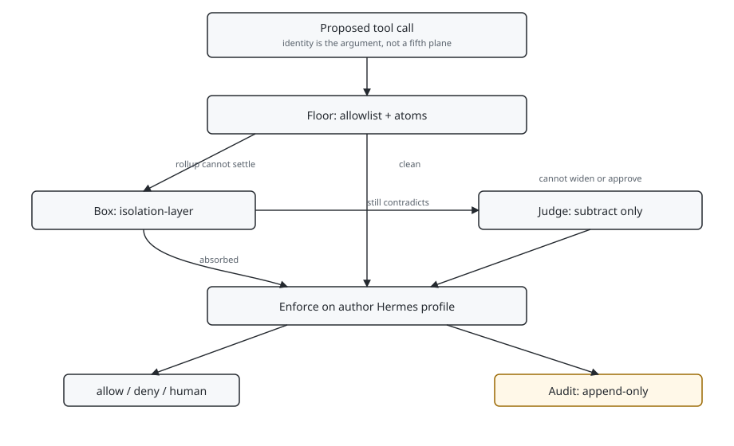
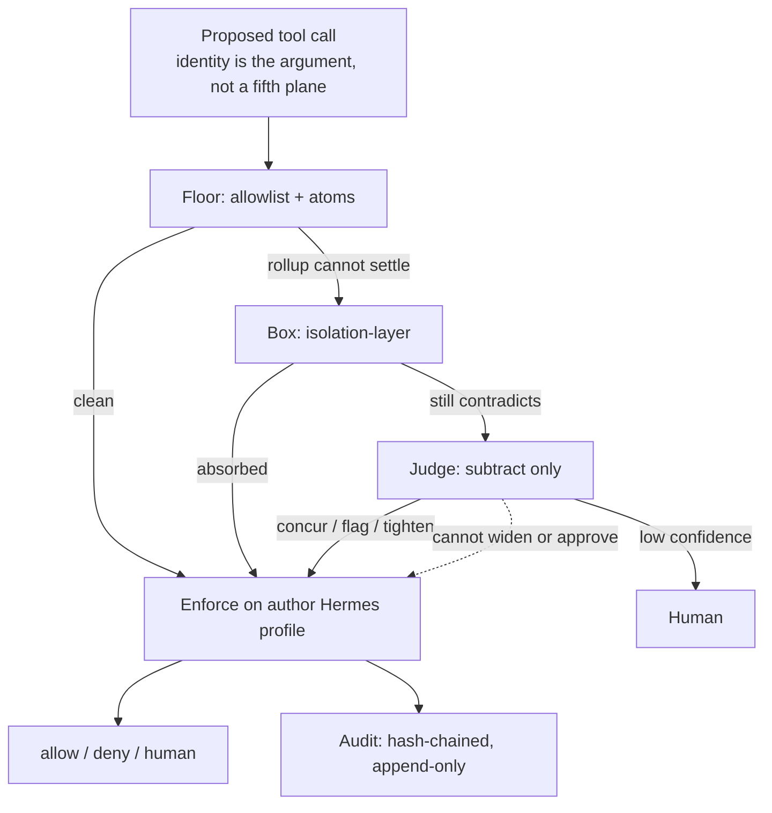

# Landen Stecker

**AI &amp; Agent Security Engineer** &nbsp;&middot;&nbsp; Navy Veteran &nbsp;&middot;&nbsp; CISSP

*From securing the system to securing the decision it makes.*

---

I built four escalation layers for AI agents. A decision can resolve at any level. It escalates due to ambiguity or contradiction the previous layer could not settle. I operate the gate on my own work and keep a hash-chained, append-only record that supersedes and never deletes.

How this work started

I started this work in the last year of my undergraduate degree in Cybersecurity Technology, building trading systems out of my own research before I held any professional certification. Running them taught me that an autonomous system holding keys, executing unattended, and ingesting outside data is an attack surface before it is a strategy, so I built it security-minded from the first commit. Encrypted credentials, secrets resolved at runtime instead of stored, graceful degradation under failure, and a refusal to feed my models any data I had not checked for tampering or poisoning.

That instinct was a student's, though, not yet a professional's. I knew the difference between building carefully and being able to stand behind a claim that a system handling real money was secure, and I did not yet have the second. Closing that gap is what came next. Security+ in October 2025, my B.S. conferred that December, and both the ISC2 CC and CISSP exams passed in early March 2026, a week apart, just before I began a full-time M.S. in Artificial Intelligence at Santa Clara.

## What I'm building

The design is four planes. Identity is the argument they take, not a fifth plane. The floor decides on structural facts before a call executes. The adjudicator above it can only subtract from what the floor allows. The box contains, and it sits between the two rather than after both, so a contradiction runs somewhere disposable and dies there before anything pays for an adjudication call. The audit attests, because "it was the AI" is not an answer a regulator accepts.

A call resolves at the floor when the fact is structural. It escalates to the box, then the judge, when the previous layer cannot settle the contradiction. The judge can only subtract. Enforce runs on my Hermes profile. `always_invoked` is false. The audit is hash-chained and append-only. It supersedes and does not delete.

  
  
  
  
  
  

| Plane | Roof | Live |
|---|---|---|
| Floor | [capability-gate](https://github.com/Steck43/capability-gate) | enforce on my Hermes profile. DOI [10.5281/zenodo.22018053](https://doi.org/10.5281/zenodo.22018053) |
| Atom plane | [aegis-atoms](https://github.com/Steck43/aegis-atoms) | subtract applied on that mount. triad plugin not mounted |
| Box | [isolation-layer](https://github.com/Steck43/isolation-layer) | default `main`. always-invoked is design intent only |
| Judge | same mount as atoms | subtract-only. never widen |
| Evidence | [dual-lab](https://github.com/Steck43/owasp-dual-top10-lab) · [newwave](https://github.com/Steck43/newwave-owasp-security-lab) | ASI depth is Reproduced, not Demonstrated |

**The floor. [capability-gate](https://github.com/Steck43/capability-gate).** A deny-by-default capability gate for an AI agent's tool calls. Every tool call that reaches the gate is checked against an allowlist before it runs, and a call outside what the skill was granted does not execute. Deterministic code makes the decision, not the model being guarded against. It fails closed, fails loud on a bad policy, and logs every decision before the action runs. The host runtime still fails open if a hook throws. Configured in enforce on my own Hermes profile, after a documented observe, would-deny, adjudicate chain. Least privilege at an agent's point of action.

**The atom plane. [aegis-atoms](https://github.com/Steck43/aegis-atoms).** Atom plane plus a bounded subtract-only judge. The live Hermes profile applies that subtract. Not the live allowlist. The triad plugin is not mounted.

**Isolation. [isolation-layer](https://github.com/Steck43/isolation-layer).** Firecracker microVM under the jailer, a six-crate Rust tree, default branch `main`. Built on its own tree and not consumed by the gate. Always-invoked is design intent only. SPIRE on the isolation host only.

**The dual lab. [owasp-dual-top10-lab](https://github.com/Steck43/owasp-dual-top10-lab).** OWASP LLM 2025 slugs with 2026 columns, plus the Agentic list, with harnessed oracles. ASI depth is Reproduced, not Demonstrated.

**The adjudicator.** Built, measured, and applied on the live Hermes mount. Bounded and subtract-only: concur, flag, tighten, escalate, never widen. A prompt-injected judge therefore degrades to denial of service rather than privilege escalation. A paid model sitting in an authorization path is also a denial-of-wallet surface, so it refuses before issuing once its budget is spent, and exhaustion returns the floor's verdict rather than opening or blocking.

## What I broke first

**[newwave-owasp-security-lab](https://github.com/Steck43/newwave-owasp-security-lab).** A hands-on OWASP LLM Top 10 security lab. An unsafe versus hardened finance assistant with archived live-model evidence, seven of the ten risks carrying archived in-lab capture from live model APIs, mapped to MITRE ATLAS and NIST AI RMF. Honest about which risks carry captured evidence and which are still open. LLM10 Unbounded Consumption is one of the seven, and it is the same risk the budget control above is built against: captured in one repository, defended in another.

Other work and background

**[crypto-signal-confluence](https://github.com/Steck43/crypto-signal-confluence).** A research instrument that tests whether fusing volume, sentiment, and technical signals produces predictive edge under honest validation and realistic trading costs. It is not a profitable bot and does not claim to be. Edge on real data is unproven, and saying so plainly is the point. The repository carries purged cross-validation, a sentiment ablation, a transaction-cost study, and a clear account of what is validated, what is exploratory, and what is not yet tested.

**[cpt-reimbursement-engine](https://github.com/Steck43/cpt-reimbursement-engine).** A dependency-free TypeScript engine that predicts where Medicare reimbursement fails, not just whether a code exists. Forty-nine tests validated against CMS actuals. Every output is computed at runtime rather than hardcoded, tagged with its provenance, and routed to review instead of a confident wrong answer when the signal is weak.

- Navy veteran, nearly seven years.
- B.S. Cybersecurity Technology, University of Maryland Global Campus, 2025. Computer science minor. Capstone work in blockchain and machine learning, and an APT32 threat risk analysis using MITRE ATT&amp;CK.
- CompTIA Security+. ISC2 Certified in Cybersecurity. ISC2 CISSP.
- M.S. Artificial Intelligence, Santa Clara University. Full-time, in progress.

My focus is AI and agent security.

